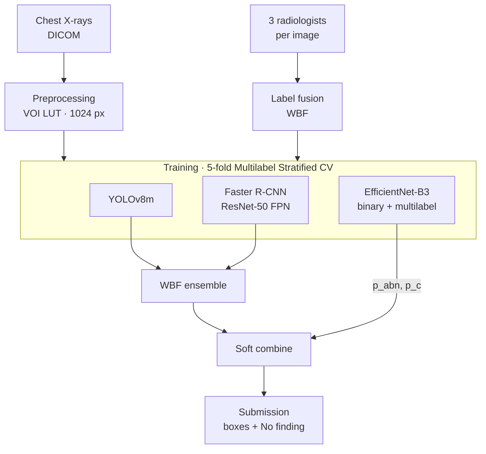

# Chest X-ray Abnormality Detection (VinBigData, Kaggle)

Detection and localization of 14 thoracic abnormalities in chest X-rays, built for the Kaggle competition
[VinBigData Chest X-ray Abnormalities Detection](https://www.kaggle.com/c/vinbigdata-chest-xray-abnormalities-detection)
(18,000 radiographs, $50,000 prize pool, 1,275 teams).

The system combines two object detectors of different families with a two-head image classifier, and fuses them
with Weighted Boxes Fusion and a soft, score-level combination. Every design choice was driven by an exploratory
analysis of the data and verified with an ablation study.

## Results

| | Score |
|---|---|
| **Kaggle private leaderboard** (mAP@0.4, 15 classes) | **0.234** |
| Kaggle public leaderboard | 0.209 |
| Estimated rank | ~184 / 1,275 (top 15%) |
| Out-of-fold validation mAP@0.4 (fold 0) | 0.482 |

The competition has ended, so late submissions are scored but not placed on the leaderboard. The rank is estimated
by comparing the private score with the final private leaderboard.


## System



- **Preprocessing.** DICOM → VOI LUT → MONOCHROME1 inversion → percentile normalization → 1024 × 1024 PNG.
- **Label fusion.** Each training image was labeled independently by three radiologists. Their boxes are fused per
  class with WBF (IoU 0.4, the metric threshold), and every fused box keeps the number of radiologists who marked it.
- **Detectors.** YOLOv8m (one-stage, anchor-free) and Faster R-CNN with ResNet-50 FPN (two-stage), both at 1024 px.
  They reach the same mAP but make different mistakes: Faster R-CNN finds more, YOLO ranks better.
- **Classifier.** One EfficientNet-B3 backbone with two heads: a binary head (`p_abn`, is the image abnormal) and a
  14-class multilabel head (`p_c`) trained on soft labels – the fraction of radiologists who marked each class.
- **Fusion.** Detector outputs are fused with WBF. Each box score is then weighted by the classifier
  (`score · p_abn^α · p_c^β`), and every image gets a *No finding* prediction with score `1 − p_abn`. All fusion
  parameters are tuned on out-of-fold predictions.

## What each stage adds


| Stage | mAP@0.4, 14 findings | mAP@0.4, 15 classes |
|---|---|---|
| YOLOv8m alone | 0.370 | 0.346 |
| Faster R-CNN alone | 0.371 | 0.346 |
| + WBF of both detectors | 0.423 | 0.395 |
| + binary head (No finding, score weighting) | 0.437 | 0.474 |
| + multilabel head (per-class β) | **0.445** | **0.482** |

## Key decisions and the evidence behind them

- **Soft combine instead of a hard "2-class filter".** Dropping all boxes when `p_abn` is low is a common trick in this
  competition. Here every gate threshold tested (0.01–0.2) emptied 29–42 truly abnormal images and lowered mAP, so the
  classifier only re-weights scores.
- **No horizontal flip, mosaic or mixup.** The EDA showed strong anatomical position per class (e.g. the aorta and the
  heart are always on the same side); these augmentations break it.
- **1024 px and 16-px anchors.** Box sizes span four orders of magnitude; about 10% of Nodule/Mass boxes are smaller than
  16 px even at 1024.
- **Two detector families.** Equal mAP, different strengths per class; fusing them gave the largest single gain (+0.052).
- **Honest per-class tuning.** Settings chosen per class (detector weights, β) are validated fold by fold: chosen on four
  folds, measured on the fifth, and kept only if they beat one shared setting on the held-out folds.

| Class frequency and radiologist agreement | Final AP per class |
|---|---|
|  |  |

Detection recall follows radiologist agreement closely: findings marked by all three radiologists are found in
98–100% of cases, findings marked by a single radiologist in 79%. The gap between validation (0.482) and the test
set (0.234) comes mainly from this: training labels are three independent readings, while the test set was labeled by
a consensus of five radiologists.


<sub>Validation images. Green dashed: fused radiologist boxes. Red: predictions with score ≥ 0.2.</sub>

## Repository

```
├── src/
│   └── vbd_utils.py            shared code: paths, competition metric (VOC mAP@0.4), reports,
│                               WBF / soft combine, per-class selection with fold check, submission
├── notebooks/
│   ├── eda.ipynb               exploratory data analysis
│   ├── 00_prep.ipynb           DICOM → PNG, label fusion, folds, detector training lists
│   ├── 01_classifier.ipynb     EfficientNet-B3, binary + multilabel heads
│   ├── 02_yolo.ipynb           YOLOv8m
│   ├── 03_frcnn.ipynb          Faster R-CNN ResNet-50 FPN
│   ├── 04_ensemble_eval.ipynb  fusion, tuning, ablation and full evaluation (out-of-fold)
│   └── 05_submission.ipynb     applies the tuned pipeline to the test set
├── assets/                     figures used in this README
└── docs/                       project report and EDA summary (Hebrew)
```

## Running it

The notebooks are written for Kaggle (GPU T4, 12-hour sessions); the competition data is not included in this repository.

1. Upload `src/vbd_utils.py` as a Kaggle Dataset and attach it, together with the competition data, to every notebook.
2. Run `00_prep` once (CPU).
3. Run `01`, `02` and `03` for each fold – set `FOLDS` in the configuration cell (e.g. `[0]`, `[1, 2]`, `[3, 4]`)
   so every run fits in a 12-hour session. Attach the output of `00_prep` to each.
4. Run `04_ensemble_eval` (CPU) with the outputs of all training runs attached. It writes `pipeline_params.json`.
5. Run `05_submission` (CPU) with the same inputs plus `04`, and submit `submission.csv`.

Each notebook finds its inputs by file name, so outputs from several sessions can simply be attached together.

## Stack

PyTorch · torchvision · Ultralytics YOLOv8 · timm · albumentations · ensemble-boxes · pydicom · scikit-learn · pandas

## Authors

Doron Farhi and Noga Maor – final project, Deep Learning course, Afeka College of Engineering, 2026.

## References

- H. Q. Nguyen et al., *VinDr-CXR: An open dataset of chest X-rays with radiologist's annotations*, Scientific Data, 2022.
- R. Solovyev, W. Wang, T. Gabruseva, *Weighted boxes fusion: Ensembling boxes from different object detection models*, Image and Vision Computing, 2021.
- S. Ren et al., *Faster R-CNN*, NeurIPS 2015 · M. Tan, Q. V. Le, *EfficientNet*, ICML 2019 · [Ultralytics YOLOv8](https://github.com/ultralytics/ultralytics).
